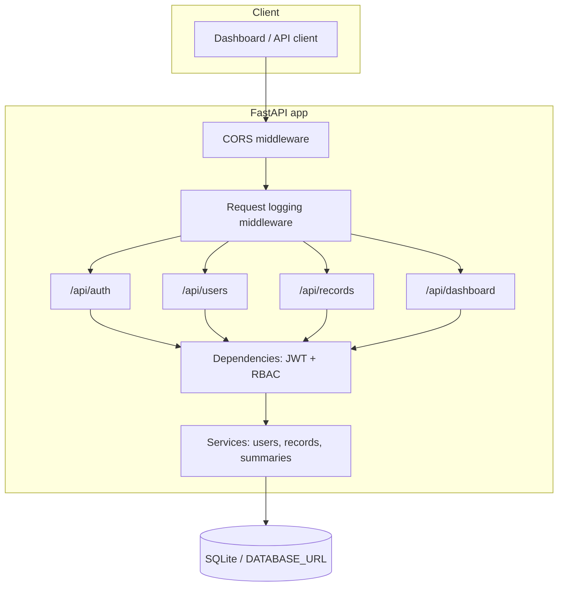

# Finance Dashboard Backend

REST API for a finance dashboard with **role-based access control**, **financial record CRUD** (with filtering and soft delete), and **aggregated dashboard** endpoints. Built with **FastAPI**, **SQLAlchemy 2**, and **SQLite** for easy local development.

## Architecture

High-level flow: HTTP enters **FastAPI**, optional **CORS** and **request logging** middleware run first, then **route handlers** resolve **RBAC** via **dependencies** (JWT → user → permission). Handlers delegate to **services**, which use **SQLAlchemy** sessions against **SQLite** (or any SQLAlchemy URL).



## Assumptions

- **Authentication**: JWT bearer tokens issued after OAuth2-style login (`username` = email, `password` = password). Tokens embed only the user id; role and `is_active` are always read from the database on each request.
- **Roles and permissions**:
  - **Viewer**: `GET /api/dashboard/*` only (summary aggregates and trends). Does **not** receive itemized `recent_activity` in the summary response.
  - **Analyst**: dashboard endpoints **plus** read access to financial records (`GET /api/records`, `GET /api/records/{id}`). No create/update/delete.
  - **Admin**: full record management and user management (create/update users, assign roles, activate/deactivate).
- **User lifecycle**: Users are not hard-deleted; use `PATCH /api/users/{id}` with `is_active: false` to deactivate.
- **Financial records**: Deletes are **soft** (`is_deleted`); excluded from queries and aggregates.
- **Persistence**: Default SQLite file `finance.db` in the project root (override with `DATABASE_URL`).

## Quick start

```bash
cd zorvyn
python -m venv .venv
.venv\Scripts\activate
pip install -r requirements.txt
python scripts\seed.py
uvicorn app.main:app --reload
```

- API base: `http://127.0.0.1:8000/api`
- OpenAPI docs: `http://127.0.0.1:8000/docs`

### Docker

Build and run the API (SQLite data persisted in a named volume at `/data/finance.db` inside the container):

```bash
docker compose up --build
```

Seed demo users (run once after the first start):

```bash
docker compose run --rm api python scripts/seed.py
```

Override secrets via environment (example):

```bash
set SECRET_KEY=your-secret && docker compose up --build
```

On Linux or macOS, use `export SECRET_KEY=...` instead of `set`.

### Seeded credentials (after `scripts/seed.py`)

| Email | Password | Role |
|--------|-----------|------|
| admin@example.com | admin12345 | admin |
| analyst@example.com | analyst12345 | analyst |
| viewer@example.com | viewer12345 | viewer |

## Environment

| Variable | Default | Description |
|----------|---------|-------------|
| `DATABASE_URL` | `sqlite:///./finance.db` | SQLAlchemy URL |
| `SECRET_KEY` | (dev default) | JWT signing secret — **change in any shared environment** |
| `ACCESS_TOKEN_EXPIRE_MINUTES` | `1440` | Token lifetime |
| `LOG_LEVEL` | `INFO` | Root / app / uvicorn log level (`DEBUG`, `INFO`, `WARNING`, …). Request lines use logger `app.http`; duplicate `uvicorn.access` lines are suppressed at `INFO`. |

### Logging

Logging is configured in `app/logging_config.py` when `app.main` loads: structured lines to **stdout** (`timestamp | level | logger | message`), plus **`RequestLoggingMiddleware`** (`app.http`) for each request with client IP, method, path, status, and duration. Uvicorn’s access logger is kept at **WARNING** so it does not duplicate those lines at `INFO`.

## API overview

### Auth

- `POST /api/auth/login` — form body: `username` (email), `password` → `{ "access_token", "token_type" }`
- `GET /api/auth/me` — current user (requires `Authorization: Bearer …`)

### Users (admin)

- `GET /api/users` — list (pagination `skip`, `limit`)
- `POST /api/users` — create (`UserCreate`: email, password, optional name, role)
- `GET /api/users/{id}` — detail
- `PATCH /api/users/{id}` — update name, role, password, `is_active` (cannot deactivate self)

### Financial records (analyst read; admin write)

- `GET /api/records` — filters: `type`, `category`, `date_from`, `date_to`, pagination `page`, `page_size`
- `POST /api/records` — create
- `GET /api/records/{id}` — detail
- `PATCH /api/records/{id}` — partial update
- `DELETE /api/records/{id}` — soft delete

### Dashboard (viewer+)

- `GET /api/dashboard/summary` — totals, net, category breakdown; optional `date_from`, `date_to`, `recent_limit` (recent rows only for analyst/admin)
- `GET /api/dashboard/trends` — `granularity=month|week`, optional date range

## Tests

```bash
pytest tests/ -q
```

## Tradeoffs

- **SQLite**: simple and sufficient for the assignment; production would likely use PostgreSQL and migrations (e.g. Alembic).
- **CORS `*`**: convenient for local dashboards; tighten for production.
- **No rate limiting** in core scope; optional hardening for public deployments.
# expense-tracker-backend
